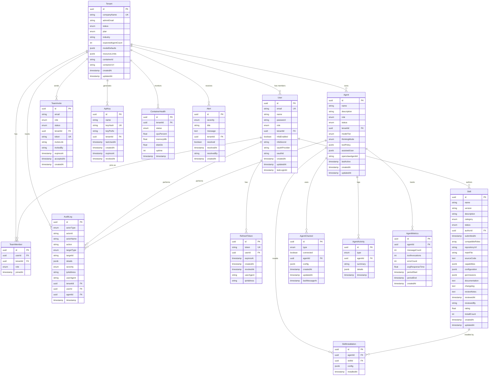

# Aegis Platform - Entity Relationship Diagram

## Mermaid ER Diagram



## Relationship Summary

### One-to-Many (1:N) Relationships

| Parent | Child | Relationship | Delete Policy |
|--------|-------|--------------|---------------|
| Tenant | User | has members | CASCADE |
| Tenant | Agent | owns agents | CASCADE |
| Tenant | TeamMember | has team | CASCADE |
| Tenant | TeamInvite | sends invites | CASCADE |
| Tenant | ApiKey | generates keys | CASCADE |
| Tenant | ContainerHealth | monitors health | CASCADE |
| Tenant | Alert | receives alerts | CASCADE |
| Tenant | AuditLog | tracks actions | CASCADE |
| User | RefreshToken | has tokens | CASCADE |
| User | TeamMember | joins tenants | CASCADE |
| User | Skill | authors skills | RESTRICT |
| User | AuditLog | performs actions | SET NULL |
| Agent | AgentChannel | uses channels | CASCADE |
| Agent | AgentActivity | logs activity | CASCADE |
| Agent | AgentMetrics | tracks metrics | CASCADE |
| Agent | SkillInstallation | installs skills | CASCADE |
| Agent | AuditLog | performs actions | SET NULL |
| Skill | SkillInstallation | installed by agents | CASCADE |

### Many-to-Many (M:N) Relationships

| Entity A | Entity B | Junction Table | Notes |
|----------|----------|----------------|-------|
| Agent | Skill | SkillInstallation | Tracks installed skills with config |
| User | Tenant | TeamMember | Tracks user membership with role |

### Key Constraints

#### Unique Constraints (Business Logic)
- `User.email` - Email must be unique across platform
- `User.oauthProvider + oauthId` - OAuth identity must be unique
- `Tenant.companyName` - Company name must be unique
- `Skill.name + version` - Skill versions must be unique
- `RefreshToken.token` - Token must be unique
- `ApiKey.keyHash` - API key hash must be unique
- `TeamInvite.token` - Invite token must be unique
- `TeamMember.userId + tenantId` - User can only join tenant once
- `SkillInstallation.agentId + skillId` - Skill can only be installed once per agent

#### Foreign Key Constraints (Referential Integrity)
All foreign keys use proper ON DELETE policies:
- **CASCADE**: Child deleted when parent deleted (most relationships)
- **SET NULL**: Reference set to NULL when parent deleted (audit logs)
- **RESTRICT**: Prevent parent deletion if children exist (skill authors)

## Data Flow Patterns

### User Authentication Flow
```
User → RefreshToken (1:N)
  ↓
Login → Create RefreshToken
  ↓
Refresh → Validate RefreshToken → New AccessToken
  ↓
Logout → Revoke RefreshToken
```

### Tenant Provisioning Flow
```
Create Tenant (status: provisioning)
  ↓
Generate Container → Update containerId
  ↓
Create Admin User → Link to Tenant
  ↓
Send Team Invite → Create TeamInvite
  ↓
Update Status (status: active)
  ↓
Start Monitoring → Create ContainerHealth records
```

### Agent Creation Flow
```
Create Agent (status: provisioning)
  ↓
Configure Channels → Create AgentChannel
  ↓
Install Skills → Create SkillInstallation
  ↓
Update Status (status: active)
  ↓
Start Logging → Create AgentActivity records
  ↓
Start Metrics → Create AgentMetrics records
```

### Skill Publishing Flow
```
User Authors Skill (status: pending)
  ↓
Submit for Review (status: in_review)
  ↓
Platform Admin Reviews → Add reviewNotes
  ↓
Approve/Reject → Update status
  ↓
If Approved → Available in Marketplace
  ↓
Install by Agent → Create SkillInstallation
```

### Audit Trail Flow
```
Action Performed (User/Agent/System)
  ↓
Create AuditLog Entry
  - Actor: who performed
  - Target: what was affected
  - Details: context (masked)
  - Severity: classification
  ↓
Hot Storage (90 days in PostgreSQL)
  ↓
Archival Job → Cold Storage (S3, 1 year)
```

## Multi-Tenancy Isolation

### Tenant-Scoped Tables (with tenantId)
1. User (nullable for platform admins)
2. Agent
3. TeamMember
4. TeamInvite
5. ApiKey
6. ContainerHealth
7. Alert
8. AuditLog (nullable for platform-wide logs)

### Platform-Wide Tables (no tenantId)
1. RefreshToken (user-scoped)
2. Skill (marketplace-wide)
3. SkillInstallation (agent-scoped via agent.tenantId)
4. AgentChannel (agent-scoped via agent.tenantId)
5. AgentActivity (agent-scoped via agent.tenantId)
6. AgentMetrics (agent-scoped via agent.tenantId)

### Isolation Strategy
```
Query Pattern:
  1. Identify user's tenantId from JWT
  2. Filter all queries by tenantId
  3. Enforce at application layer + RLS at database layer

Row-Level Security (RLS):
  - Enable RLS on all tenant-scoped tables
  - Policy: WHERE tenantId = current_setting('app.tenant_id')
  - Set tenant context per request
```

## Index Strategy Visual

```
Performance Hotspots:
┌─────────────────────────────────────────┐
│ Tenant-Scoped Queries                   │
│ ┌─────────┐                             │
│ │tenantId │ → Most common filter        │
│ └─────────┘   All queries start here    │
└─────────────────────────────────────────┘
        ↓
┌─────────────────────────────────────────┐
│ Status Filtering                        │
│ ┌────────┐                              │
│ │ status │ → Fast enum lookup           │
│ └────────┘   Indexed on all tables      │
└─────────────────────────────────────────┘
        ↓
┌─────────────────────────────────────────┐
│ Time-Series Queries                     │
│ ┌───────────┐                           │
│ │ timestamp │ → BETWEEN queries         │
│ └───────────┘   Indexed on activity     │
└─────────────────────────────────────────┘
        ↓
┌─────────────────────────────────────────┐
│ JSONB Queries (Optional GIN)            │
│ ┌──────────┐                            │
│ │ JSONB    │ → Advanced filtering       │
│ └──────────┘   GIN index recommended    │
└─────────────────────────────────────────┘
```

## Security Boundaries

```
┌─────────────────────────────────────────────┐
│ Platform Admin                              │
│ - Full access to all tenants                │
│ - Skill review and approval                 │
│ - Platform-wide alerts                      │
│ - All audit logs                            │
└─────────────────────────────────────────────┘
        ↓ (manages)
┌─────────────────────────────────────────────┐
│ Tenant Admin                                │
│ - Full access to own tenant                 │
│ - Manage team members                       │
│ - Create/manage agents                      │
│ - View tenant-scoped audit logs             │
└─────────────────────────────────────────────┘
        ↓ (manages)
┌─────────────────────────────────────────────┐
│ Tenant Member                               │
│ - Read-only access to tenant                │
│ - View agents assigned to them              │
│ - Limited audit log access                  │
└─────────────────────────────────────────────┘
```

---

**Document Version**: 1.0.0
**Schema Version**: 2.0.0
**Last Updated**: 2026-02-06
