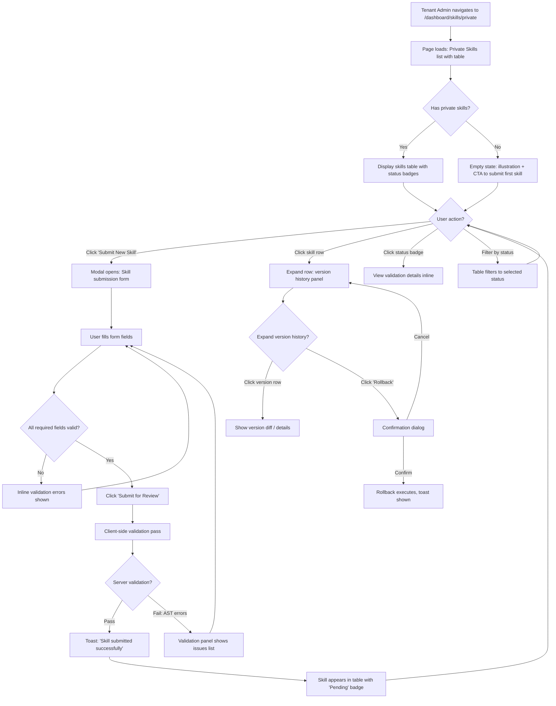
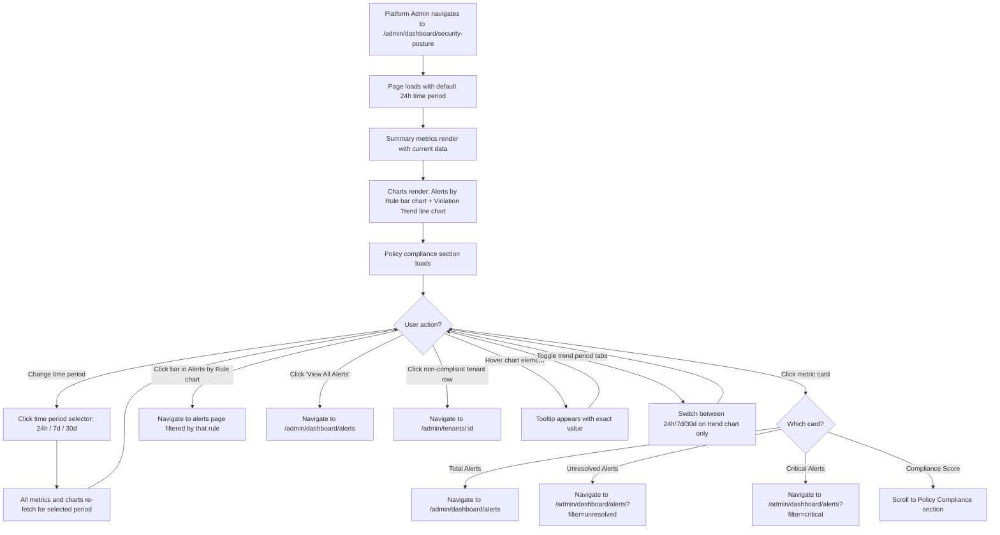
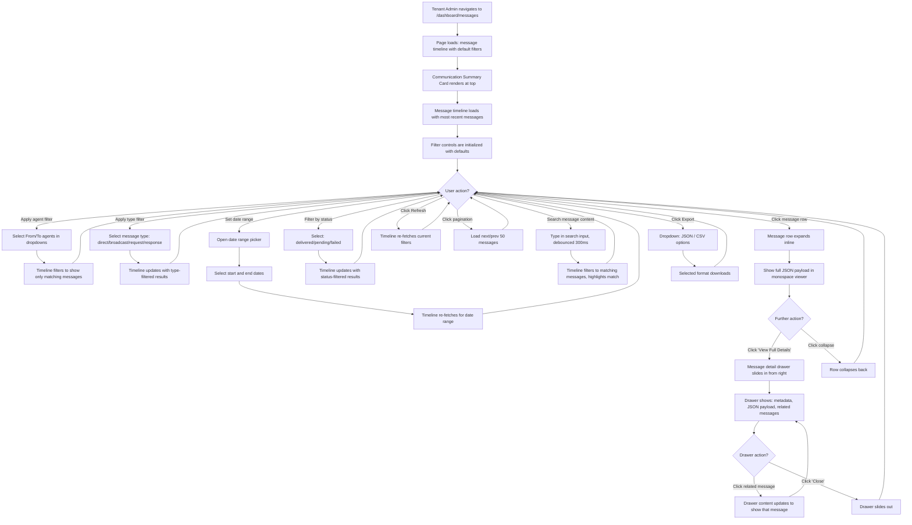

# User Flows & Wireframe Specifications -- Sprint 8 Screens

**Document Owner:** UX Design
**Last Updated:** 2026-02-10
**Design System Reference:** `design-artifacts/theme.yaml` v1.0.0
**Target Screens:** 3 new screens for Sprint 8 features

---

## Table of Contents

1. [Screen 1: Private Skill Upload Form](#screen-1-private-skill-upload-form)
2. [Screen 2: Security Posture Dashboard](#screen-2-security-posture-dashboard)
3. [Screen 3: Inter-Agent Message Dashboard](#screen-3-inter-agent-message-dashboard)
4. [Cross-Screen Design Conventions](#cross-screen-design-conventions)
5. [Responsive Behavior Notes](#responsive-behavior-notes)

---

## Screen 1: Private Skill Upload Form

**Route:** `/dashboard/skills/private`
**Context:** Tenant Admin Dashboard (sidebar layout with "Skill Marketplace" section active)
**File:** `design-artifacts/screens/private-skill-upload.html`

### 1.1 User Flow Diagram



### 1.2 Component Hierarchy

```
Page Shell (sidebar layout, 256px sidebar)
+-- Sidebar (Tenant Admin variant, "Skill Marketplace" active)
+-- Main Content Area (margin-left: 256px)
    +-- Page Header Row
    |   +-- Title Block
    |   |   +-- H1: "Private Skills" (text-2xl font-bold tracking-tight)
    |   |   +-- Subtitle: "Manage your team's custom skill registry" (text-sm text-neutral-500)
    |   +-- Action Group (flex, gap-3)
    |       +-- [Secondary] "Export" button (border, neutral)
    |       +-- [Primary] "Submit New Skill" button (bg-primary-500, white text, plus icon)
    |
    +-- Filter Bar (bg-white, rounded-xl, border, shadow-sm, p-4)
    |   +-- Status Filter Pills (flex, gap-1.5)
    |   |   +-- "All" pill (active: bg-primary-500 text-white)
    |   |   +-- "Pending" pill (bg-amber-50 text-amber-700 border-amber-200)
    |   |   +-- "Approved" pill (bg-emerald-50 text-emerald-700 border-emerald-200)
    |   |   +-- "Rejected" pill (bg-red-50 text-red-700 border-red-200)
    |   +-- Spacer (flex-1)
    |   +-- Search Input (relative, search icon left, rounded-lg, max-w-xs)
    |   +-- Skill Count (font-mono text-sm text-neutral-500)
    |
    +-- Skills Table (bg-white, rounded-xl, border, shadow-sm, overflow-hidden)
    |   +-- Table Header Row (bg-neutral-50, border-b)
    |   |   +-- TH: Name (sortable)
    |   |   +-- TH: Version (font-mono)
    |   |   +-- TH: Category
    |   |   +-- TH: Status
    |   |   +-- TH: Submitted
    |   |   +-- TH: Validation
    |   |   +-- TH: Actions
    |   |
    |   +-- Table Body (divide-y)
    |   |   +-- Skill Row (cursor-pointer, hover:bg-primary-50/30)
    |   |   |   +-- TD: Skill icon (gradient circle) + name (font-medium) + description (text-xs text-neutral-400)
    |   |   |   +-- TD: Version number (font-mono text-sm)
    |   |   |   +-- TD: Category badge (bg-neutral-100, rounded-full, text-xs)
    |   |   |   +-- TD: Status Badge
    |   |   |   |   +-- Pending: bg-amber-50 text-amber-700 border-amber-200 + dot
    |   |   |   |   +-- Approved: bg-emerald-50 text-emerald-700 border-emerald-200 + checkmark
    |   |   |   |   +-- Rejected: bg-red-50 text-red-700 border-red-200 + x-mark
    |   |   |   +-- TD: Date (font-mono text-xs text-neutral-500)
    |   |   |   +-- TD: Validation indicator
    |   |   |   |   +-- Pass: green checkmark + "Passed" text
    |   |   |   |   +-- Fail: red x + issue count
    |   |   |   |   +-- Pending: spinner + "Running..."
    |   |   |   +-- TD: Actions (icon buttons)
    |   |   |       +-- Eye icon (view detail)
    |   |   |       +-- History icon (version history)
    |   |   |       +-- Ellipsis icon (more: delete, duplicate)
    |   |   |
    |   |   +-- Expandable Version History Panel (per row)
    |   |       +-- Version Timeline (vertical line, dots)
    |   |       |   +-- Version Entry (flex row)
    |   |       |       +-- Version badge (font-mono, rounded-full)
    |   |       |       +-- Date (text-xs text-neutral-500)
    |   |       |       +-- Status badge (sm)
    |   |       |       +-- "Rollback" button (text link, primary)
    |   |       +-- Divider
    |   |
    |   +-- Pagination Footer (border-t, bg-neutral-50/50)
    |       +-- Results count (text-sm text-neutral-500)
    |       +-- Page number buttons (same pattern as audit-log.html)
    |
    +-- Submit Skill Modal (overlay: rgba(0,0,0,0.5) + blur(4px))
        +-- Modal Container (bg-white, rounded-xl, shadow-xl, max-w-2xl, w-full)
            +-- Modal Header (flex justify-between, pb-4, border-b)
            |   +-- Title: "Submit New Skill" (text-xl font-semibold)
            |   +-- Close button (ghost, x icon)
            |
            +-- Modal Body (overflow-y-auto, max-h-[70vh], py-6, space-y-5)
            |   +-- Field: Skill Name (text input, required, label: "Skill Name")
            |   +-- Field Row (grid grid-cols-2 gap-4)
            |   |   +-- Field: Version (text input, placeholder: "1.0.0", pattern: semver)
            |   |   +-- Field: Category (select dropdown)
            |   |       Options: productivity, analytics, engineering,
            |   |                communication, security, integration, custom
            |   +-- Field: Description (textarea, 3 rows)
            |   +-- Field: Compatible Roles (checkbox group, flex flex-wrap gap-3)
            |   |   +-- Checkbox: Coordinator
            |   |   +-- Checkbox: Executor
            |   |   +-- Checkbox: Analyst
            |   |   +-- Checkbox: Monitor
            |   |
            |   +-- Divider + Section Label: "Source Code" (h3, font-semibold)
            |   +-- Field: Code Editor Area
            |   |   +-- Header bar (bg-neutral-900 rounded-t-lg px-4 py-2)
            |   |   |   +-- File name indicator (font-mono text-xs text-neutral-400)
            |   |   |   +-- Language label: "TypeScript" (badge, text-xs)
            |   |   +-- Code area (bg-primary-950, font-mono, text-sm, min-h-[200px], p-4, rounded-b-lg)
            |   |       Monospace textarea with line numbers gutter
            |   |
            |   +-- Divider + Section Label: "Permissions Manifest" (h3, font-semibold)
            |   +-- Permissions Accordion Sections
            |       +-- Network Permissions (collapsible)
            |       |   +-- Label: "Allowed Domains"
            |       |   +-- Tag Input (chips: each domain as removable tag)
            |       |   |   +-- Tag: bg-primary-50 text-primary-700 rounded-full px-2.5 py-0.5
            |       |   |   +-- Input area for new tag (inline)
            |       |   +-- Helper text: "Enter domain names your skill needs to access"
            |       |
            |       +-- File Permissions (collapsible)
            |       |   +-- Read Paths (tag input)
            |       |   +-- Write Paths (tag input)
            |       |
            |       +-- Environment Variables (collapsible)
            |           +-- Required Vars (tag input)
            |           +-- Optional Vars (tag input)
            |           +-- Helper: "These will be requested from the tenant during install"
            |
            +-- Modal Footer (flex justify-between, pt-4, border-t)
                +-- Left: Validation status indicator
                |   +-- Icon + "Validation will run on submit"
                +-- Right: Button group (flex, gap-3)
                    +-- [Ghost] "Cancel" button
                    +-- [Primary] "Submit for Review" button
```

### 1.3 Interaction Patterns

**Hover States:**
- Table rows: `bg-primary-50/30` background transition (150ms ease-out)
- Status badges: slight scale(1.02) on hover
- Action icon buttons: `bg-neutral-100` circle background appears on hover
- "Submit New Skill" primary button: `bg-primary-600` (darkens from 500)

**Click Actions:**
- "Submit New Skill" CTA: Opens modal with smooth entrance animation (opacity 200ms + transform 300ms spring easing)
- Table row click: Toggles version history panel (same expand/collapse as audit-log.html)
- Status filter pills: Toggle active state (active pill: `bg-primary-500 text-white`; inactive: `bg-neutral-50 text-neutral-600 border`)
- "Rollback" link in version history: Opens confirmation dialog before executing
- Tag input "x" button: Removes tag with fade-out (opacity 150ms)

**Transitions:**
- Modal enter: Overlay fades in (opacity 200ms), modal slides up + fades in (transform + opacity 300ms spring)
- Modal exit: Reverse of enter (200ms ease-in)
- Table row expand: Max-height transition from 0 to content height (300ms ease-out) matching audit-log pattern
- Status filter switch: Color transition (150ms ease-out)
- Validation indicator: Spinner animation while validation runs, then cross-fade to result icon (200ms)

**Form Validation:**
- Inline validation on blur for each field
- Skill name: Required, 3-50 characters
- Version: Must match semver pattern (x.y.z)
- Category: Required selection
- Source code: Required, minimum 10 lines
- Real-time domain validation in tag input (must be valid domain format)
- Submit button disabled state with `bg-primary-200 cursor-not-allowed` when form is invalid

### 1.4 Empty State

When no private skills exist yet:
- Centered illustration area (subtle SVG of a puzzle piece or code brackets)
- Heading: "No private skills yet" (text-lg font-semibold text-neutral-700)
- Subtext: "Submit your first custom skill to get started" (text-sm text-neutral-500)
- CTA button: "Submit New Skill" (primary, centered)

---

## Screen 2: Security Posture Dashboard

**Route:** `/admin/dashboard/security-posture`
**Context:** Platform Admin Dashboard (admin sidebar with "Security Posture" active under Security section)
**File:** `design-artifacts/screens/security-posture-dashboard.html`

### 2.1 User Flow Diagram



### 2.2 Component Hierarchy

```
Page Shell (admin sidebar layout, 256px sidebar)
+-- Admin Sidebar (Platform Admin variant)
|   +-- Logo: Aegis Platform (shield icon + gradient bg)
|   +-- Navigation sections:
|       +-- OVERVIEW: Dashboard, Tenants
|       +-- SECURITY: Security Posture (active), Alerts, Audit Log
|       +-- MARKETPLACE: Skill Review Queue, All Skills
|       +-- SYSTEM: Settings
|
+-- Main Content Area (margin-left: 256px)
    +-- Page Header Row (flex justify-between items-center)
    |   +-- Title Block
    |   |   +-- H1: "Security Posture" (text-2xl font-bold tracking-tight)
    |   |   +-- Subtitle: "Platform-wide security health and compliance overview" (text-sm text-neutral-500)
    |   +-- Right Controls (flex gap-3)
    |       +-- Time Period Selector (segmented control: bg-neutral-100 rounded-lg p-1)
    |       |   +-- "24h" button
    |       |   +-- "7d" button (active: bg-white shadow-sm text-neutral-900)
    |       |   +-- "30d" button
    |       +-- "View All Alerts" link button (text-primary-600, arrow-right icon)
    |
    +-- Metric Cards Row (grid grid-cols-4 gap-4)
    |   +-- Card 1: Total Alerts
    |   |   +-- Icon (bell, bg-primary-50 text-primary-500, rounded-lg)
    |   |   +-- Label: "TOTAL ALERTS" (text-xs font-semibold uppercase tracking-wider text-neutral-500)
    |   |   +-- Value: "47" (text-2xl font-bold text-neutral-900)
    |   |   +-- Trend: "+12% vs prev period" (text-xs, red if up, green if down)
    |   |       +-- Up arrow icon + percentage (text-red-600 for increase)
    |   |
    |   +-- Card 2: Unresolved Alerts
    |   |   +-- Icon (alert-circle, bg-amber-50 text-amber-500, rounded-lg)
    |   |   +-- Label: "UNRESOLVED" (text-xs uppercase)
    |   |   +-- Value: "12" (text-2xl font-bold)
    |   |   +-- Conditional highlight: if value > 0, card gets left border-l-4 border-amber-400
    |   |   +-- Trend: count change vs previous period
    |   |
    |   +-- Card 3: Critical Alerts
    |   |   +-- Icon (shield-alert, bg-red-50 text-red-500, rounded-lg)
    |   |   +-- Label: "CRITICAL" (text-xs uppercase)
    |   |   +-- Value: "3" (text-2xl font-bold text-red-600 if > 0)
    |   |   +-- Red pulse dot if value > 0 (pulse animation, same as admin-dashboard.html)
    |   |   +-- Conditional: card border-l-4 border-red-400 when > 0
    |   |
    |   +-- Card 4: Compliance Score
    |       +-- Circular Progress Indicator (SVG, 56x56)
    |       |   +-- Background ring: stroke neutral-200
    |       |   +-- Progress ring: stroke primary-500 (or amber-500 if < 80%, red-500 if < 60%)
    |       |   +-- Center text: percentage (font-bold text-lg)
    |       +-- Label: "COMPLIANCE SCORE" (text-xs uppercase)
    |       +-- Subtext: "87% of tenants compliant" (text-xs text-neutral-500)
    |
    +-- Two-Column Chart Section (grid grid-cols-2 gap-6)
    |   +-- Left: Alerts by Rule Card (bg-white, rounded-xl, border, shadow-sm)
    |   |   +-- Card Header (flex justify-between, pb-4)
    |   |   |   +-- Title: "Alerts by Rule" (text-lg font-semibold)
    |   |   |   +-- Badge: total count (bg-neutral-100 rounded-full)
    |   |   +-- Card Body
    |   |       +-- Horizontal Bar Chart (stacked, 5 bars)
    |   |           +-- Bar: "Failed Login Spike" (bg-red-400, width proportional)
    |   |           |   +-- Label (text-sm text-neutral-700)
    |   |           |   +-- Bar fill (bg-red-400, rounded-r-md, hover:bg-red-500)
    |   |           |   +-- Count (text-sm font-mono text-neutral-600, right-aligned)
    |   |           +-- Bar: "Cross-Tenant Access" (bg-amber-400)
    |   |           +-- Bar: "Tool Policy Violation" (bg-primary-400)
    |   |           +-- Bar: "Agent Error Spike" (bg-violet-400)
    |   |           +-- Bar: "Network Policy Violation" (bg-cyan-400)
    |   |           Each bar: height 40px, gap-3 between bars,
    |   |           label left-aligned, bar fill, count right
    |   |
    |   +-- Right: Violation Trend Card (bg-white, rounded-xl, border, shadow-sm)
    |       +-- Card Header (flex justify-between, pb-4)
    |       |   +-- Title: "Permission Violations" (text-lg font-semibold)
    |       |   +-- Trend Period Tabs (inline, text-xs)
    |       |       +-- "24h" / "7d" / "30d" toggle (underline active tab)
    |       +-- Card Body
    |       |   +-- Line Chart Area (SVG or canvas, h-[200px])
    |       |   |   +-- X-axis: time labels (font-mono text-xs text-neutral-400)
    |       |   |   +-- Y-axis: violation count (font-mono text-xs text-neutral-400)
    |       |   |   +-- Line: stroke primary-500, strokeWidth 2
    |       |   |   +-- Fill: primary-500/10 gradient below line
    |       |   |   +-- Hover tooltip: exact value + timestamp
    |       |   +-- Trend Summary Bar (flex items-center gap-4, pt-3, border-t)
    |       |       +-- Trend arrow + percentage change (text-sm)
    |       |       +-- Direction label: "Decreasing" or "Increasing" or "Stable"
    |       |       +-- Colored dot: green (decreasing), red (increasing), neutral (stable)
    |
    +-- Policy Compliance Section (bg-white, rounded-xl, border, shadow-sm)
        +-- Section Header (flex justify-between, p-6 pb-4)
        |   +-- Title: "Policy Compliance" (text-lg font-semibold)
        |   +-- Summary: "X of Y tenants compliant" (text-sm text-neutral-500)
        +-- Progress Bar (full width, h-2, rounded-full, mx-6)
        |   +-- Background: bg-neutral-100
        |   +-- Fill: bg-primary-500 (width = compliance percentage)
        |   +-- Milestone markers at 60%, 80%, 100% thresholds
        +-- Compliance Table (border-t, mt-4)
            +-- Table Header (bg-neutral-50)
            |   +-- TH: Tenant Name
            |   +-- TH: Plan Tier
            |   +-- TH: Active Agents
            |   +-- TH: Skills with Manifest
            |   +-- TH: Network Policy
            |   +-- TH: Compliance Status
            +-- Table Body
                +-- Row per non-compliant tenant
                    +-- TD: Tenant name (font-medium) + slug (text-xs font-mono text-neutral-400)
                    +-- TD: Plan badge (Business/Enterprise/Free)
                    +-- TD: Agent count (text-sm)
                    +-- TD: "X of Y" with mini progress bar
                    +-- TD: Status icon (check/x) for network policy configured
                    +-- TD: Compliance badge
                        +-- Compliant: bg-emerald-50 text-emerald-700
                        +-- Non-compliant: bg-red-50 text-red-700
                        +-- Partial: bg-amber-50 text-amber-700
```

### 2.3 Interaction Patterns

**Hover States:**
- Metric cards: `card-hover` class (translateY(-1px), enhanced shadow), cursor-pointer
- Bar chart bars: Darken fill color on hover (e.g., `bg-red-400` to `bg-red-500`), show tooltip with exact count
- Line chart points: Show dot + tooltip with value and timestamp
- Table rows: `bg-primary-50/30` background
- Time period selector buttons: `bg-neutral-200` background on hover for inactive buttons

**Click Actions:**
- Metric cards: Navigate to filtered alerts page (each card filters differently)
- Bar chart bars: Navigate to `/admin/dashboard/alerts?rule=<rule-name>`
- "View All Alerts" link: Navigate to `/admin/dashboard/alerts`
- Non-compliant tenant rows: Navigate to `/admin/tenants/:id`
- Time period selector: Refetches all data for selected range (skeleton loading during fetch)
- Trend period tabs: Only refreshes the violation trend chart (local re-render)

**Transitions:**
- Page load: Metric card values count up from 0 (number animation, 500ms ease-out)
- Chart bars: Width grows from 0 to target (400ms ease-out, staggered 50ms per bar)
- Line chart: Path draws in from left to right (800ms ease-in-out)
- Time period switch: Fade out current data (150ms), skeleton state, fade in new (200ms)
- Card hover: Shadow expansion (200ms ease-in-out)

**Data States:**
- Loading: Skeleton pulse animation on all cards and chart areas
- Error: Error card with retry button replaces the failed section (not the whole page)
- No alerts: Celebration/shield icon + "All clear -- No security alerts in this period"

### 2.4 Metric Card Conditional Styling

| Condition | Visual Treatment |
|---|---|
| Unresolved > 0 | Card gets `border-l-4 border-amber-400`, value text is `text-amber-600` |
| Critical > 0 | Card gets `border-l-4 border-red-400`, value text is `text-red-600`, pulse dot appears |
| Compliance < 60% | Progress ring is `stroke-red-500`, label text is `text-red-600` |
| Compliance 60-80% | Progress ring is `stroke-amber-500`, label text is `text-amber-600` |
| Compliance > 80% | Progress ring is `stroke-primary-500` (default green/indigo) |
| Trend increasing (bad) | Trend arrow up, `text-red-600` |
| Trend decreasing (good) | Trend arrow down, `text-emerald-600` |
| Trend stable | Horizontal arrow, `text-neutral-500` |

---

## Screen 3: Inter-Agent Message Dashboard

**Route:** `/dashboard/messages`
**Context:** Tenant Admin Dashboard (sidebar layout, new "Messages" nav item under Workspace section)
**File:** `design-artifacts/screens/inter-agent-messages.html`

### 3.1 User Flow Diagram



### 3.2 Component Hierarchy

```
Page Shell (sidebar layout, 256px sidebar)
+-- Sidebar (Tenant Admin variant, "Messages" nav item active)
|   +-- New nav item under Workspace section:
|       Messages icon (message-square from Lucide) + "Messages" label
|
+-- Main Content Area (margin-left: 256px)
    +-- Page Header Row (flex justify-between items-center)
    |   +-- Title Block
    |   |   +-- H1: "Agent Messages" (text-2xl font-bold tracking-tight)
    |   |   +-- Subtitle: "Monitor inter-agent communication within your workspace" (text-sm text-neutral-500)
    |   +-- Action Group (flex gap-3 items-center)
    |       +-- Refresh Button (ghost, icon-only, rotate icon)
    |       +-- Export Dropdown Button (secondary, download icon + "Export")
    |       |   +-- Dropdown: "Export as JSON" / "Export as CSV"
    |       +-- Message Count (font-mono text-sm text-neutral-500)
    |
    +-- Communication Summary Card (optional, collapsible) (bg-white, rounded-xl, border, p-5)
    |   +-- Mini Graph (right side, 200x120px)
    |   |   +-- Agent nodes (circles with avatar initials, positioned in loose cluster)
    |   |   +-- Message count edges (lines between nodes, thickness = message volume)
    |   |   +-- Legend: "Messages in last 24h"
    |   +-- Summary Stats (left side, flex gap-8)
    |       +-- Stat: Total Messages (value + label)
    |       +-- Stat: Active Conversations (value + label)
    |       +-- Stat: Avg Response Time (value + label)
    |       +-- Stat: Failed Messages (value + label, red if > 0)
    |
    +-- Filter Bar (bg-white, rounded-xl, border, shadow-sm, p-4)
    |   +-- Row 1: Primary Filters (flex flex-wrap gap-3)
    |   |   +-- Agent Pair Filter (flex gap-2 items-center)
    |   |   |   +-- "From:" label (text-xs font-medium text-neutral-500)
    |   |   |   +-- From Agent Dropdown (select, w-40)
    |   |   |       +-- Options: "All Agents", Agent 1, Agent 2...
    |   |   |   +-- Arrow icon (text-neutral-300)
    |   |   |   +-- "To:" label
    |   |   |   +-- To Agent Dropdown (select, w-40)
    |   |   |
    |   |   +-- Divider (w-px h-6 bg-neutral-200)
    |   |   |
    |   |   +-- Type Filter Pills (flex gap-1.5)
    |   |   |   +-- "All" pill (active state)
    |   |   |   +-- "Direct" pill (bg-primary-50 text-primary-600 when selected)
    |   |   |   +-- "Broadcast" pill (bg-violet-50 text-violet-600 when selected)
    |   |   |   +-- "Request" pill (bg-blue-50 text-blue-600 when selected)
    |   |   |   +-- "Response" pill (bg-emerald-50 text-emerald-600 when selected)
    |   |   |
    |   |   +-- Divider
    |   |   |
    |   |   +-- Status Filter Dropdown
    |   |   |   +-- Options: All, Delivered, Pending, Failed
    |   |   |
    |   |   +-- Date Range Picker (calendar icon + date display)
    |   |
    |   +-- Row 2: Search + Clear (flex gap-3, mt-3)
    |       +-- Search Input (full width, search icon left, placeholder: "Search message content...")
    |       +-- "Clear Filters" text button (text-primary-600, text-sm)
    |
    +-- Message Timeline (bg-white, rounded-xl, border, shadow-sm, flex-1, overflow-hidden)
    |   +-- Timeline Header (flex justify-between, px-6 py-3, border-b, bg-neutral-50)
    |   |   +-- Column labels (flex)
    |   |   |   +-- "TIME" (text-xs font-semibold uppercase tracking-wider text-neutral-500)
    |   |   |   +-- "FROM" (text-xs uppercase)
    |   |   |   +-- "TO" (text-xs uppercase)
    |   |   |   +-- "TYPE" (text-xs uppercase)
    |   |   |   +-- "MESSAGE" (text-xs uppercase)
    |   |   |   +-- "STATUS" (text-xs uppercase)
    |   |   +-- Sort indicator
    |   |
    |   +-- Timeline Body (divide-y, overflow-y-auto)
    |   |   +-- Message Row (cursor-pointer, hover:bg-primary-50/30, px-6 py-3)
    |   |   |   +-- Expand Chevron (w-4 h-4, same pattern as audit-log)
    |   |   |   +-- Timestamp (font-mono text-xs text-neutral-500, tabular-nums)
    |   |   |   +-- From Agent Cell (flex items-center gap-2)
    |   |   |   |   +-- Avatar circle (w-7 h-7, gradient bg, initials text)
    |   |   |   |   +-- Agent name (text-sm font-medium)
    |   |   |   +-- Arrow Icon (text-neutral-300, flex-shrink-0)
    |   |   |   +-- To Agent Cell (same structure as From)
    |   |   |   |   Note: For broadcast, show "All Agents" with broadcast icon
    |   |   |   +-- Type Badge
    |   |   |   |   +-- Direct: bg-primary-50 text-primary-700 border-primary-200
    |   |   |   |   +-- Broadcast: bg-violet-50 text-violet-700 border-violet-200
    |   |   |   |   +-- Request: bg-blue-50 text-blue-700 border-blue-200
    |   |   |   |   +-- Response: bg-emerald-50 text-emerald-700 border-emerald-200
    |   |   |   +-- Message Preview (text-sm text-neutral-600, truncate, max-w-xs)
    |   |   |   +-- Status Indicator
    |   |   |       +-- Delivered: green dot (8px)
    |   |   |       +-- Pending: amber dot + pulse animation
    |   |   |       +-- Failed: red dot + "Failed" text
    |   |   |
    |   |   +-- Expanded Message Detail (collapsible, same pattern as audit-log rows)
    |   |       +-- Container (px-12 py-4 bg-neutral-50/70 border-t)
    |   |           +-- Metadata Row (flex gap-6, text-xs text-neutral-500, mb-3)
    |   |           |   +-- Message ID (font-mono)
    |   |           |   +-- Correlation ID (font-mono)
    |   |           |   +-- Delivery time (font-mono)
    |   |           |   +-- "View Full Details" link (text-primary-600)
    |   |           +-- JSON Payload Viewer
    |   |               +-- Header bar (bg-neutral-900, rounded-t-lg)
    |   |               |   +-- "Payload" label (font-mono text-xs text-neutral-400)
    |   |               |   +-- Copy button (ghost, clipboard icon)
    |   |               +-- Code block (bg-primary-950, text-primary-200, font-mono text-xs, p-4, rounded-b-lg)
    |   |
    |   +-- Pagination Footer (border-t, bg-neutral-50/50)
    |       +-- Results: "Showing 1-50 of 1,234 messages"
    |       +-- Page controls (same pattern as audit-log)
    |       +-- Per-page selector: "50 per page" dropdown
    |
    +-- Message Detail Drawer (fixed, right-0, top-0, h-full, w-[480px], bg-white, shadow-2xl, z-50)
        +-- Drawer Overlay (fixed inset-0, bg-black/50, backdrop-blur-sm)
        +-- Drawer Panel (slide-in from right, 300ms ease-out)
            +-- Drawer Header (flex justify-between, p-6, border-b)
            |   +-- Title: "Message Details" (text-lg font-semibold)
            |   +-- Close button (ghost, x icon)
            |
            +-- Drawer Body (overflow-y-auto, flex-1)
            |   +-- Metadata Section (p-6, space-y-4)
            |   |   +-- Row: Message ID (label + mono value)
            |   |   +-- Row: From Agent (avatar + name)
            |   |   +-- Row: To Agent (avatar + name)
            |   |   +-- Row: Type (badge)
            |   |   +-- Row: Status (badge + timestamp)
            |   |   +-- Row: Sent At (font-mono)
            |   |   +-- Row: Delivered At (font-mono)
            |   |   +-- Row: Correlation ID (font-mono, for request/response pairing)
            |   |
            |   +-- Divider
            |   +-- Payload Section (p-6)
            |   |   +-- Section Title: "Message Payload"
            |   |   +-- JSON Viewer (same dark code block as expanded row, but larger)
            |   |   +-- Copy Full Payload button (secondary, below code block)
            |   |
            |   +-- Divider
            |   +-- Related Messages Section (p-6)
            |       +-- Section Title: "Conversation Thread" (text-sm font-semibold)
            |       +-- Thread list (vertical timeline, max 10 messages)
            |           +-- Thread Entry (clickable, hover:bg-neutral-50)
            |               +-- Left: Vertical line connector
            |               +-- Dot (color-coded by type)
            |               +-- Agent name + timestamp
            |               +-- Message preview (1 line, truncate)
            |
            +-- Drawer Footer (p-6, border-t)
                +-- "Close" button (secondary, full width)
```

### 3.3 Interaction Patterns

**Hover States:**
- Message rows: `bg-primary-50/30` transition (150ms ease-out)
- Agent avatar circles: Scale(1.1) with shadow-sm
- Type badges: Slight brightness increase
- Thread entries in drawer: `bg-neutral-50` background
- Export dropdown items: `bg-primary-50 text-primary-700`

**Click Actions:**
- Message row: Toggle inline expand (same chevron rotation pattern as audit-log)
- "View Full Details" link: Opens detail drawer from the right
- Agent name in row/drawer: Could link to agent detail page
- Related message in drawer: Updates drawer content to show that message (smooth content transition)
- Copy button on payload: Copies JSON to clipboard, shows "Copied!" tooltip (2s auto-dismiss)
- Refresh button: Rotates icon 360 degrees during fetch
- Filter dropdowns/pills: Immediate re-filter of timeline data
- Search input: Debounced 300ms, then filters; matching text highlighted with `bg-amber-100` spans

**Transitions:**
- Drawer open: Overlay fades in (200ms), panel slides from right (300ms ease-out)
- Drawer close: Panel slides right (200ms ease-in), overlay fades (150ms)
- Message row expand: Max-height transition (300ms ease-out, matching audit-log)
- Filter state change: Table body fades out (100ms), skeleton, fades in (200ms)
- Search highlight: Smooth background-color transition on matched text
- Refresh icon: `rotate(360deg)` transform (600ms linear) during data fetch

**Message Type Color Coding:**

| Type | Badge BG | Badge Text | Badge Border | Row Accent |
|---|---|---|---|---|
| Direct | `bg-primary-50` | `text-primary-700` | `border-primary-200` | Left border `border-l-2 border-primary-300` |
| Broadcast | `bg-violet-50` | `text-violet-700` | `border-violet-200` | Left border `border-l-2 border-violet-300` |
| Request | `bg-blue-50` | `text-blue-700` | `border-blue-200` | Left border `border-l-2 border-blue-300` |
| Response | `bg-emerald-50` | `text-emerald-700` | `border-emerald-200` | Left border `border-l-2 border-emerald-300` |

**Status Indicators:**

| Status | Visual |
|---|---|
| Delivered | Green dot (8px, `bg-emerald-500`), no text |
| Pending | Amber dot (8px, `bg-amber-500`) with pulse animation |
| Failed | Red dot (8px, `bg-red-500`) + "Failed" text (`text-red-600 text-xs font-medium`) |

---

## Cross-Screen Design Conventions

These conventions ensure visual consistency across all three new screens, matching the established patterns from existing screens.

### Layout

- **Sidebar:** Fixed, 256px expanded / 64px collapsed. White background, `border-r border-neutral-200`. Collapse toggle at bottom.
- **Main content:** `margin-left: 256px` (adjusts on sidebar collapse). Max content width: `max-w-6xl` for tenant screens, full-bleed for admin data-heavy screens.
- **Page padding:** `px-6 lg:px-8 pt-6 lg:pt-8`.
- **Section spacing:** `gap-6` between major sections.

### Typography

- **Page title:** `text-2xl font-bold text-neutral-900 tracking-tight` (Inter)
- **Page subtitle:** `text-sm text-neutral-500 mt-1` (Inter)
- **Section headings:** `text-lg font-semibold text-neutral-900` (Inter)
- **Table headers:** `text-xs font-semibold text-neutral-500 uppercase tracking-wider` (Inter)
- **Body text:** `text-sm text-neutral-700` (Inter)
- **Monospace values:** `font-mono` (JetBrains Mono) for timestamps, IDs, versions, code
- **Badge text:** `text-xs font-medium` (Inter)

### Component Patterns

- **Cards:** `bg-white rounded-xl border border-neutral-200 shadow-sm` (matches audit-log filter bar, admin-dashboard cards)
- **Tables:** Full-width inside card container. Header: `bg-neutral-50`. Row hover: `bg-primary-50/30`. Expandable rows use same chevron rotation + max-height animation as audit-log.
- **Buttons:**
  - Primary: `bg-primary-500 text-white hover:bg-primary-600 shadow-sm rounded-lg`
  - Secondary: `bg-white border border-neutral-200 text-neutral-700 hover:bg-neutral-50 shadow-sm rounded-lg`
  - Ghost: `bg-transparent text-neutral-600 hover:bg-neutral-100 rounded-lg`
  - Destructive: `bg-red-500 text-white hover:bg-red-600 rounded-lg`
- **Badges:** Pill shape (`rounded-full`), size `sm` for table cells (px-2.5 py-0.5 text-xs), color-coded by semantic meaning.
- **Dropdowns:** `bg-white rounded-lg shadow-lg border border-neutral-200`, items: `px-4 py-2 text-sm hover:bg-primary-50 hover:text-primary-700`.
- **Modals:** Overlay: `bg-black/50 backdrop-blur-sm`. Container: `bg-white rounded-xl shadow-xl max-w-2xl`. Entry animation: spring easing.
- **Drawers:** Right-aligned, `w-[480px]`, same overlay pattern as modals, slide-in from right.
- **Empty states:** Centered in content area, subtle SVG illustration, heading + description + CTA button.
- **Toast notifications:** `max-w-400px`, positioned top-right, `z-70`. Success: green, Error: red, Info: blue.

### Tailwind Config

All three screens share the same Tailwind config block used across existing screens:

```javascript
tailwind.config = {
  theme: {
    extend: {
      fontFamily: {
        sans: ['Inter', 'system-ui', '-apple-system', 'sans-serif'],
        mono: ['JetBrains Mono', 'monospace'],
      },
      colors: {
        primary: {
          50: '#eef2ff', 100: '#e0e7ff', 200: '#c7d2fe', 300: '#a5b4fc',
          400: '#818cf8', 500: '#6366f1', 600: '#4f46e5', 700: '#4338ca',
          800: '#3730a3', 900: '#312e81', 950: '#1e1b4b',
        },
        neutral: {
          50: '#f8fafc', 100: '#f1f5f9', 200: '#e2e8f0', 300: '#cbd5e1',
          400: '#94a3b8', 500: '#64748b', 600: '#475569', 700: '#334155',
          800: '#1e293b', 900: '#0f172a',
        }
      }
    }
  }
}
```

### Scrollbar Styling (all screens)

```css
::-webkit-scrollbar { width: 6px; height: 6px; }
::-webkit-scrollbar-track { background: transparent; }
::-webkit-scrollbar-thumb { background: #c7d2fe; border-radius: 3px; }
::-webkit-scrollbar-thumb:hover { background: #a5b4fc; }
```

### Prototype Navigation Bridge (all screens)

Each screen includes the standard navigation bridge script that communicates with the parent prototype frame:

```javascript
if (window.parent !== window) {
  document.addEventListener('click', (e) => {
    const link = e.target.closest('a[href^="/"]');
    if (link) {
      window.parent.postMessage({ type: 'navigate', href: link.getAttribute('href') }, '*');
      e.preventDefault();
      e.stopPropagation();
    }
  }, true);
}
```

---

## Responsive Behavior Notes

### Breakpoint Strategy

All three screens follow the platform-wide responsive strategy:

| Breakpoint | Width | Behavior |
|---|---|---|
| xs | 0-639px | Sidebar hidden (hamburger menu). Single-column layout. Cards stack vertically. Tables scroll horizontally. |
| sm | 640-767px | Sidebar hidden. Two-column grid for metric cards. Table remains scrollable. |
| md | 768-1023px | Sidebar collapses to 64px icon-only mode. Two-column grids where applicable. |
| lg | 1024-1279px | Sidebar expanded (256px). Full layout. |
| xl | 1280-1535px | Full layout with wider data tables. |
| 2xl | 1536px+ | Max content width caps at 1440px. Centered with auto margins. |

### Screen-Specific Responsive Notes

**Private Skill Upload Form:**
- Table columns collapse at md: hide "Category" and "Validation" columns, show in expanded view
- Modal becomes full-screen sheet on xs/sm (rounded-t-xl, slides up from bottom)
- Form fields switch from grid-cols-2 to grid-cols-1 at sm
- Code editor area: min-height reduces to 150px on mobile

**Security Posture Dashboard:**
- Metric cards: `grid-cols-4` at xl, `grid-cols-2` at md, `grid-cols-1` at xs
- Two-column chart section: `grid-cols-2` at lg, `grid-cols-1` below. Charts stack vertically.
- Compliance table: Horizontal scroll with sticky first column at md and below
- Time period selector: Moves below page title on xs (stacks vertically)
- Circular progress indicator: Size reduces from 56px to 48px on sm

**Inter-Agent Message Dashboard:**
- Filter bar: Wraps to multiple rows on sm. Agent pair filter stacks vertically.
- Communication summary card: Hidden on xs (too much space). Mini graph hidden on sm, only stats shown.
- Message timeline: "FROM" and "TO" columns merge into single "AGENTS" column with stacked layout on sm
- Detail drawer: Becomes full-screen sheet on xs/sm (same as modal behavior)
- JSON payload viewer: Horizontal scroll, reduced padding on mobile
- Pagination: Simplified on xs (only prev/next buttons, no page numbers)

### Touch Targets

All interactive elements maintain 44x44px minimum touch target on mobile, per WCAG 2.1 AA requirements:
- Table row tap targets: Full row width, min-height 48px
- Buttons: Min-height 36px, min-width 36px for icon-only
- Filter pills: Min-height 32px, adequate horizontal padding
- Drawer close button: 44x44px tap area

### Accessibility Notes

- All three screens support keyboard navigation (Tab order follows visual order)
- Expandable rows: Enter/Space to toggle, Escape to collapse
- Drawers/Modals: Focus trap while open, Escape to close, focus returns to trigger element
- Filter controls: Proper `aria-label` attributes on all interactive elements
- Status badges: Include screen-reader text (e.g., `aria-label="Status: Pending review"`)
- Charts: Include `aria-label` with data summary text for screen readers
- Color is never the sole indicator of meaning (always paired with text/icon)

---

## Screen Inventory Summary

```yaml
screens:
  - name: "Private Skill Upload"
    route: "/dashboard/skills/private"
    file: "design-artifacts/screens/private-skill-upload.html"
    context: "tenant_admin"
    purpose: "Manage custom skill submissions for private tenant registry"
    elements:
      - skills_table
      - status_filter_pills
      - submit_modal
      - code_editor
      - permissions_manifest_form
      - tag_input
      - version_history_panel
      - validation_indicator
    entry_points:
      - sidebar_navigation
      - skill_marketplace_private_tab
    exit_points:
      - submit_for_review
      - view_skill_detail
      - rollback_version
    priority: critical_path

  - name: "Security Posture Dashboard"
    route: "/admin/dashboard/security-posture"
    file: "design-artifacts/screens/security-posture-dashboard.html"
    context: "platform_admin"
    purpose: "Platform-wide security health overview with alerts, compliance, and trends"
    elements:
      - metric_cards_row
      - alerts_by_rule_bar_chart
      - violation_trend_line_chart
      - compliance_progress_bar
      - non_compliant_tenants_table
      - time_period_selector
      - circular_progress_indicator
    entry_points:
      - admin_sidebar_navigation
      - alert_notification_link
    exit_points:
      - view_all_alerts
      - navigate_to_tenant_detail
      - navigate_to_filtered_alerts
    priority: critical_path

  - name: "Inter-Agent Message Dashboard"
    route: "/dashboard/messages"
    file: "design-artifacts/screens/inter-agent-messages.html"
    context: "tenant_admin"
    purpose: "Timeline view of all inter-agent messages with filtering, search, and detail drawer"
    elements:
      - communication_summary_card
      - filter_bar
      - agent_pair_filter
      - type_filter_pills
      - date_range_picker
      - search_input
      - message_timeline_table
      - expandable_json_viewer
      - message_detail_drawer
      - export_dropdown
      - pagination
    entry_points:
      - sidebar_navigation
      - agent_detail_messages_tab
    exit_points:
      - agent_detail_navigation
      - export_json_csv
      - message_detail_drawer
    priority: standard
```
