# Aegis Platform -- User Flows

**Last Updated:** 2026-02-05
**Document Owner:** UX Design
**Platform:** Aegis -- AI Multi-Agent SaaS Platform

---

## Table of Contents

1. [Platform Admin Flows](#1-platform-admin-flows)
   - 1.1 Tenant Provisioning
   - 1.2 Platform Monitoring
   - 1.3 Skill Marketplace Management
2. [Tenant Admin Flows](#2-tenant-admin-flows)
   - 2.1 Company Onboarding (Admin-Initiated, MVP)
   - 2.2 Agent Management
   - 2.3 Skill Installation
   - 2.4 Team Member Invitation and RBAC
3. [Tenant Member Flows](#3-tenant-member-flows)
   - 3.1 Viewing Agent Activity and Status
   - 3.2 Interacting with Agents
   - 3.3 Viewing Audit Trails
4. [Self-Service Flows (Phase 3)](#4-self-service-flows-phase-3)
   - 4.1 Public Signup and Auto-Provisioning
   - 4.2 Billing Management and Usage Monitoring

---

## 1. Platform Admin Flows

These flows are for the internal platform team operating the Aegis SaaS infrastructure.
Platform Admins access a separate admin dashboard (not customer-facing in MVP).

**Roles:** Super Admin (full access), Support Admin (read-only + limited actions)

---

### 1.1 Tenant Provisioning

**Goal:** Create a new company environment with an isolated OpenClaw container, configure it, and hand off admin credentials to the tenant.

**Trigger:** Sales closes a new customer, or existing customer requests expansion.

```mermaid
flowchart TD
    A([Platform Admin<br/>logs into Admin Dashboard]) --> B{Authenticated?}
    B -->|No| C[Login Page<br/>with MFA]
    C --> D{MFA Valid?}
    D -->|No| E[MFA Error<br/>Retry or Reset]
    E --> C
    D -->|Yes| B
    B -->|Yes| F[Admin Dashboard Home]

    F --> G[Click 'Provision New Tenant']
    G --> H[Step 1: Company Details]

    H --> H1[Enter company name]
    H1 --> H2[Enter admin email]
    H2 --> H3[Select industry]
    H3 --> H4[Enter expected agent count]
    H4 --> I{Validation Pass?}

    I -->|No - Duplicate name/email| J[Inline Error:<br/>Company name or email exists]
    J --> H1
    I -->|Yes| K[Step 2: Plan Selection]

    K --> K1[Select plan tier:<br/>Starter / Growth / Enterprise]
    K1 --> K2[Configure model defaults]
    K2 --> K3[Set resource limits:<br/>CPU, memory, disk, agents]
    K3 --> L[Step 3: Review and Confirm]

    L --> L1[Review summary:<br/>Company, plan, estimated cost]
    L1 --> M{Confirm Provision?}
    M -->|Cancel| F
    M -->|Confirm| N[API: POST /api/tenants]

    N --> O{Tenant Record Created?}
    O -->|Error| P[Show API Error<br/>Retry or contact engineering]
    P --> L
    O -->|Success| Q[Provisioning Progress Screen]

    Q --> R[Step: Creating K8s Namespace]
    R --> S[Step: Spinning Up OpenClaw Container]
    S --> T[Step: Configuring Environment Variables]
    T --> U[Step: Installing Core Skill Bundle]
    U --> V[Step: Running Health Check]

    V --> W{Health Check Pass?}
    W -->|Fail after 3 retries| X[Provisioning Failed<br/>Alert sent to engineering]
    X --> Y[Show failure details<br/>+ manual retry button]
    Y --> Q
    W -->|Pass| Z[Provisioning Complete]

    Z --> AA[Success Screen:<br/>Tenant ID, Admin invite link,<br/>Container endpoint]
    AA --> AB[Send invite email to<br/>tenant admin]
    AB --> AC([Return to Tenant List])

    style A fill:#6366f1,color:#fff
    style Z fill:#10b981,color:#fff
    style X fill:#ef4444,color:#fff
    style J fill:#f59e0b,color:#000
    style P fill:#ef4444,color:#fff
```

**Screens Involved:**

| Screen | Purpose | Epic/Feature |
|--------|---------|--------------|
| Platform Admin Login | Authentication with MFA | E2-F5 |
| Admin Dashboard Home | Overview, navigation hub | E2-F4 |
| Tenant Provisioning Wizard (Step 1) | Company details form | E2-F2 |
| Tenant Provisioning Wizard (Step 2) | Plan and resource configuration | E2-F2 |
| Tenant Provisioning Wizard (Step 3) | Review and confirm | E2-F2 |
| Provisioning Progress | Real-time provisioning status | E2-F2 |
| Provisioning Success/Failure | Result with next steps or retry | E2-F2 |
| Tenant List | Updated list showing new tenant | E2-F1 |

**Decision Points:**
- Duplicate company name or admin email -> block, show error
- Plan tier selection determines resource limits and agent caps
- Health check failure after 3 retries -> manual escalation path
- Confirm/cancel gate before triggering provisioning

**Error States:**
- Duplicate company name or email: inline validation error on Step 1
- API failure during tenant record creation: error toast with retry
- Container provisioning timeout (>5 min): progress screen shows failure, alerts engineering
- Health check failure: auto-retry 3 times, then manual retry button + engineering alert

---

### 1.2 Platform Monitoring

**Goal:** Monitor health of all tenant containers, platform services, and respond to alerts.

**Trigger:** Continuous monitoring; reactive when alerts fire.

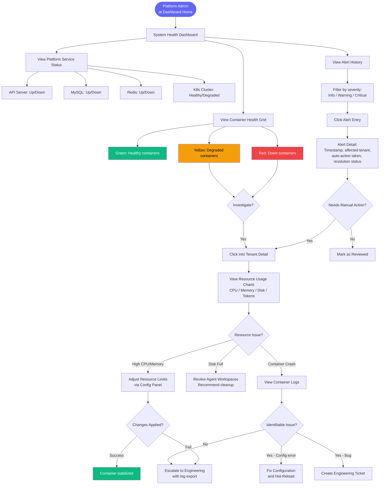

**Screens Involved:**

| Screen | Purpose | Epic/Feature |
|--------|---------|--------------|
| System Health Dashboard | Grid of all containers + platform services | E2-F4 |
| Tenant Detail (Resources Tab) | CPU, memory, disk, token charts per tenant | E2-F3 |
| Configuration Editor | Edit tenant config with validation | E2-F3 |
| Alert History Timeline | Severity-filtered alert list | E2-F4 |
| Alert Detail Modal | Full context of a single alert | E2-F4 |

**Decision Points:**
- Container color status (green/yellow/red) determines investigation priority
- Resource issue type determines resolution path (config change vs. cleanup vs. escalation)
- Unidentifiable issues always escalate to engineering with log export
- Alerts with auto-resolution marked differently from those requiring manual action

**Error States:**
- Config hot-reload fails: show error, offer container restart option
- Log export exceeds size limit: stream or paginate
- Platform service down: banner alert across all admin pages

---

### 1.3 Skill Marketplace Management

**Goal:** Review submitted skills, run security checks, and publish approved skills to the marketplace catalog.

**Trigger:** Skill developer submits a new skill for review.

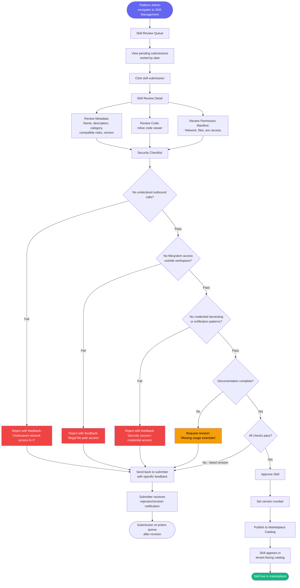

**Screens Involved:**

| Screen | Purpose | Epic/Feature |
|--------|---------|--------------|
| Skill Review Queue | List of pending skill submissions | E4-F3 |
| Skill Review Detail | Code viewer, metadata, permission manifest | E4-F3 |
| Security Checklist | Step-by-step review with pass/fail toggles | E4-F3 |
| Rejection/Revision Dialog | Structured feedback form | E4-F3 |
| Marketplace Catalog (Admin View) | Published skills with edit/unpublish actions | E4-F1 |

**Decision Points:**
- Each security checklist item is a binary gate (pass/fail)
- Any single failure -> rejection with specific feedback
- Incomplete documentation -> revision request (not hard reject)
- Version number set at publish time

**Error States:**
- Code viewer fails to render large files: paginate or show raw text
- Skill already exists with same name: version conflict resolution
- Publishing fails: retry with error context

---

## 2. Tenant Admin Flows

These flows are for customer-facing tenant administrators (VP of Product, Director of Engineering, COO) managing their company's agent team through the Tenant Admin Dashboard.

**Roles:** Tenant Admin (full within tenant), Tenant Viewer (read-only)

---

### 2.1 Company Onboarding (Admin-Initiated, MVP)

**Goal:** A new tenant admin receives an invite, sets up their account, and creates their first agent.

**Trigger:** Platform Admin provisions the tenant and sends an invite email (flow 1.1 output).

```mermaid
flowchart TD
    A([Tenant Admin receives<br/>invite email]) --> B[Click invite link]
    B --> C[Account Setup Page]

    C --> D[Set password<br/>or choose OAuth login]
    D --> D1{OAuth or Password?}
    D1 -->|OAuth| E[Redirect to Google/GitHub]
    E --> F{OAuth Success?}
    F -->|No| G[OAuth Error<br/>Try again or use password]
    G --> D
    F -->|Yes| H[Account Created]
    D1 -->|Password| I[Create password<br/>12+ chars, mixed case, special]
    I --> J{Password Valid?}
    J -->|No| K[Password strength error]
    K --> I
    J -->|Yes| H

    H --> L[First Login:<br/>Tenant Admin Dashboard]
    L --> M[Welcome Screen +<br/>Onboarding Checklist]

    M --> N[Step 1: Review Company Profile]
    N --> O[Verify company name, industry,<br/>plan tier set by platform admin]

    O --> P[Step 2: Create First Agent]
    P --> Q[Agent Creation Wizard<br/>-- see Flow 2.2 --]

    Q --> R{Agent Created?}
    R -->|Yes| S[Step 3: Connect Channel]
    S --> T[Telegram Bot Setup Walkthrough<br/>with screenshots]
    T --> U{Channel Connected?}
    U -->|No| V[Skip for now<br/>Return later from settings]
    U -->|Yes| W[Step 4: Install Recommended Skills]

    V --> W
    W --> X[Show role-appropriate skills<br/>Pre-selected recommendations]
    X --> Y[Install selected skills]
    Y --> Z[Step 5: Send Test Message]
    Z --> AA[Inline test interface<br/>Send message to agent, see response]
    AA --> AB{Agent Responds?}
    AB -->|Yes| AC[Onboarding Complete!<br/>Dashboard unlocked]
    AB -->|No - Timeout| AD[Troubleshooting tips<br/>Check channel, check skills]
    AD --> AE{Retry or Skip?}
    AE -->|Retry| Z
    AE -->|Skip| AC

    AC --> AF([Tenant Admin Dashboard<br/>with checklist widget])

    style A fill:#6366f1,color:#fff
    style AC fill:#10b981,color:#fff
    style G fill:#ef4444,color:#fff
    style K fill:#f59e0b,color:#000
    style AD fill:#f59e0b,color:#000
```

**Screens Involved:**

| Screen | Purpose | Epic/Feature |
|--------|---------|--------------|
| Invite Landing / Account Setup | Set password or OAuth | E5-F1 |
| Welcome Screen | Onboarding checklist intro | E11-F3 (Phase 3, simplified in MVP) |
| Company Profile Review | Verify company details | E5-F1 |
| Agent Creation Wizard | 5-step agent setup (detail in 2.2) | E5-F3 |
| Channel Connection Walkthrough | Telegram/Slack bot setup guide | E5-F3 |
| Skill Recommendations | Role-appropriate skill suggestions | E5-F4 |
| Test Message Interface | Send message, see agent response | E5-F3 |
| Tenant Admin Dashboard | Main dashboard with checklist | E5-F2 |

**Decision Points:**
- OAuth vs. password authentication choice
- Channel connection is skippable (not required to complete onboarding)
- Skill installation is pre-selected but customizable
- Test message failure offers retry or skip

**Error States:**
- Expired invite link: show "link expired, contact your platform admin"
- OAuth account email mismatch: prompt to use the invited email
- Password does not meet requirements: inline strength indicator
- Agent creation failure: show error, suggest retrying or contacting support
- Channel connection failure: skip option with ability to return later

---

### 2.2 Agent Management

**Goal:** Create a new agent, assign a role, configure tools/model, bind to a communication channel, and deploy.

**Trigger:** Tenant Admin decides to add a new agent to their team.

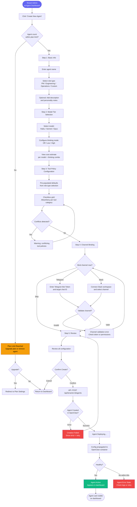

**Screens Involved:**

| Screen | Purpose | Epic/Feature |
|--------|---------|--------------|
| Agent Dashboard | Overview of all agents, create button | E5-F2 |
| Plan Limit Warning Modal | Upsell to higher plan | E12-F1 (Phase 3, soft limit in MVP) |
| Agent Wizard Step 1 | Name, role, description | E5-F3 |
| Agent Wizard Step 2 | Model tier + thinking mode + cost | E5-F3, E3-F4 |
| Agent Wizard Step 3 | Tool policy checkbox grid | E5-F3, E3-F2 |
| Agent Wizard Step 4 | Channel binding (Telegram/Slack) | E5-F3 |
| Agent Wizard Step 5 | Review summary | E5-F3 |
| Agent Deploying Progress | Status indicator while config propagates | E5-F3 |

**Decision Points:**
- Plan limit check before wizard entry (hard gate if at cap)
- Role type selection auto-populates tool policy defaults
- Model + thinking mode combo determines cost estimate
- Channel binding is optional (can be configured later)
- Tool policy conflict detection prevents invalid configurations

**Error States:**
- Plan limit exceeded: upgrade prompt or agent removal suggestion
- Tool policy conflicts: warning with explanation of conflicting rules
- Channel validation failure: specific error (bad token, wrong permissions)
- Agent creation API failure: retry with preserved form data
- Agent fails health check after creation: error state with log access

---

### 2.3 Skill Installation

**Goal:** Browse the skill marketplace, find relevant skills for an agent, install and configure them.

**Trigger:** Tenant Admin wants to extend an agent's capabilities with new integrations.

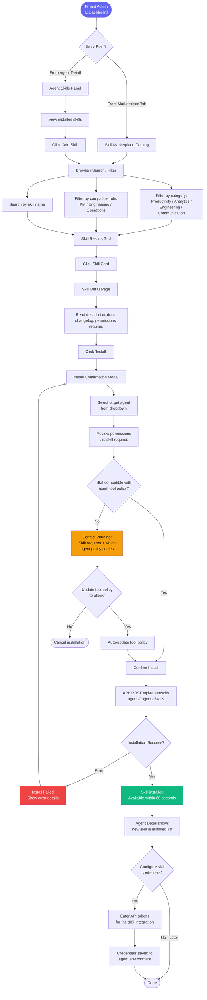

**Screens Involved:**

| Screen | Purpose | Epic/Feature |
|--------|---------|--------------|
| Skill Marketplace Catalog | Browsable grid with filters | E5-F4, E4-F1 |
| Skill Detail Page | Full docs, permissions, install button | E4-F1 |
| Agent Skills Panel | Installed skills for a specific agent | E4-F2 |
| Install Confirmation Modal | Target agent selection + permission review | E4-F2 |
| Tool Policy Conflict Dialog | Explain conflict, offer resolution | E4-F2, E3-F2 |
| Credential Configuration | Enter API tokens for the skill | E9-F3 (Phase 2, basic in MVP) |

**Decision Points:**
- Entry from marketplace (global browse) or agent detail (agent-specific)
- Target agent selection when installing from marketplace view
- Tool policy compatibility check before installation
- Option to auto-update tool policy to resolve conflicts
- Credential configuration can be deferred

**Error States:**
- Skill incompatible with agent's tool policy: conflict warning with resolution option
- Installation API failure: retry with error details
- Skill requires credential that tenant has not configured: prompt to add credential
- Skill version conflict with already-installed skill: warn and offer update

---

### 2.4 Team Member Invitation and RBAC

**Goal:** Invite team members to the tenant dashboard and assign appropriate roles.

**Trigger:** Tenant Admin wants to give colleagues access to view or manage agents.

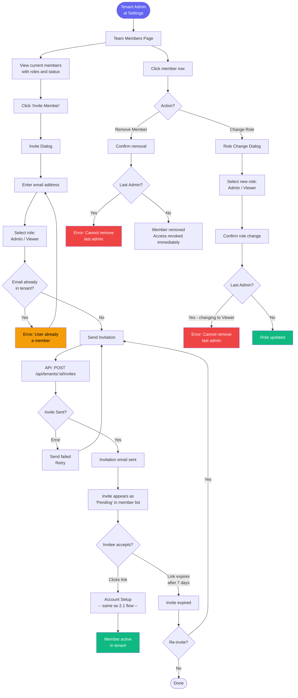

**Screens Involved:**

| Screen | Purpose | Epic/Feature |
|--------|---------|--------------|
| Team Members Page | List of all members with roles | E5-F1 |
| Invite Member Dialog | Email + role selection | E5-F1 |
| Invite Email | Email with secure link | E5-F1 |
| Account Setup (invitee) | Password/OAuth setup | E5-F1 |
| Role Change Dialog | Dropdown to change role | E6-F3 |
| Remove Confirmation Dialog | Confirm member removal | E5-F1 |

**Decision Points:**
- Role selection: Admin (full access) vs. Viewer (read-only)
- Duplicate email check before sending invite
- Last-admin protection prevents accidental lockout
- Expired invites can be re-sent

**Error States:**
- Email already a member: inline error
- Invite send failure: retry option
- Cannot remove or downgrade last admin: protective error
- Invite link expired: re-invite flow

---

## 3. Tenant Member Flows

These flows are for team members with Viewer role (read-only access) within a tenant.
They can observe agent activity but cannot modify configurations.

---

### 3.1 Viewing Agent Activity and Status

**Goal:** Understand what agents are doing, their current status, and recent activity.

**Trigger:** Tenant member logs in to check agent performance.

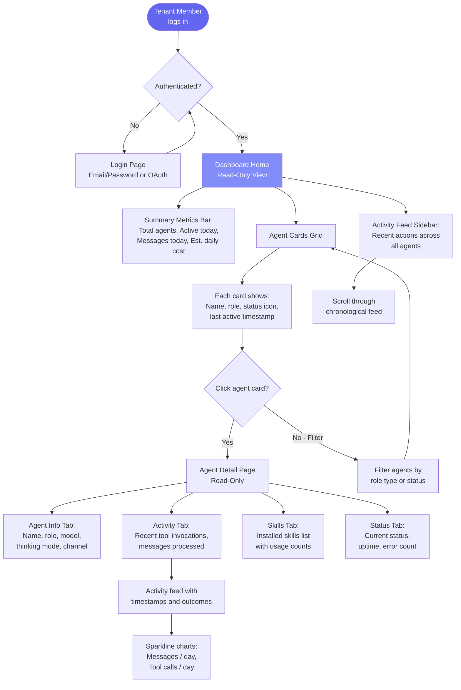

**Screens Involved:**

| Screen | Purpose | Epic/Feature |
|--------|---------|--------------|
| Login Page | Authentication | E5-F1 |
| Dashboard Home (Read-Only) | Agent cards, metrics, activity feed | E5-F2 |
| Agent Detail (Read-Only) | Tabs: info, activity, skills, status | E5-F2, E3-F3 |
| Activity Feed | Chronological agent actions | E5-F2 |

**Decision Points:**
- All screens are read-only for Viewer role; no edit/create/delete buttons visible
- Filtering helps members find specific agents in large teams
- Activity feed shows all agents or can be filtered to one

---

### 3.2 Interacting with Agents

**Goal:** Communicate with agents through their bound channels (Telegram, Slack).

**Trigger:** Tenant member needs agent assistance on a task.

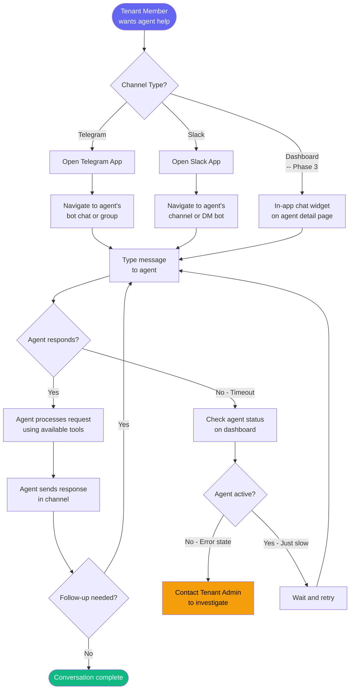

**Screens Involved:**

| Screen | Purpose | Notes |
|--------|---------|-------|
| Telegram Bot Chat | Primary agent interaction channel | External app |
| Slack Channel/DM | Alternative agent interaction channel | External app |
| Agent Detail (Status) | Check agent health if unresponsive | E3-F3 |
| In-App Chat Widget | Future: direct chat from dashboard | Phase 3+ |

**Decision Points:**
- Channel selection depends on what was configured during agent setup
- Agent unresponsiveness triggers a check on agent status
- Dashboard provides diagnostic info if agent is in error state

---

### 3.3 Viewing Audit Trails

**Goal:** Review the audit log of agent actions for compliance or investigation.

**Trigger:** Compliance review, incident investigation, or curiosity about agent behavior.

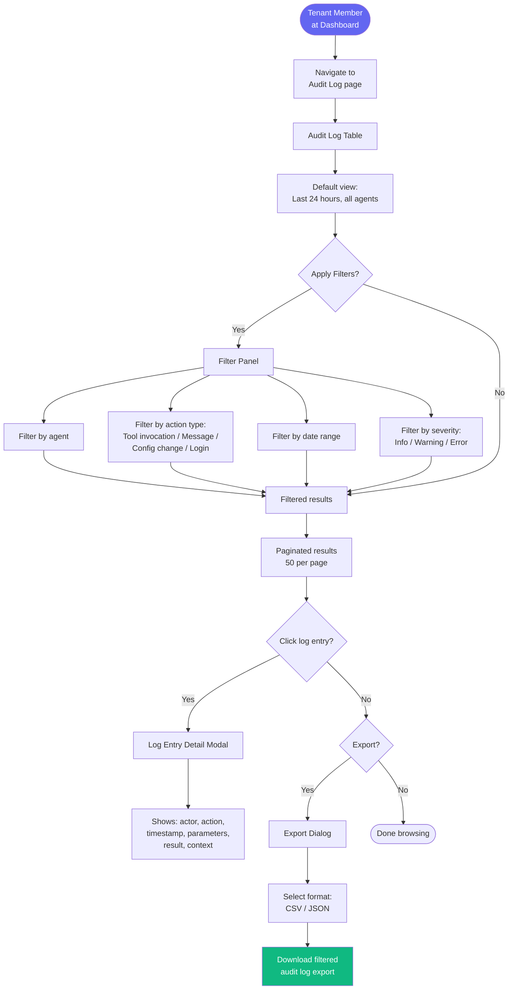

**Screens Involved:**

| Screen | Purpose | Epic/Feature |
|--------|---------|--------------|
| Audit Log Page | Searchable, filterable log table | E8-F3 |
| Filter Panel | Multi-criteria filter controls | E8-F3 |
| Log Entry Detail Modal | Full context of single action | E8-F3 |
| Export Dialog | Format selection and download | E8-F3 |

**Decision Points:**
- Default timeframe is last 24 hours (adjustable)
- Filters are combinable (agent + action type + date range)
- Export includes currently applied filters
- Sensitive parameters are masked in the UI

---

## 4. Self-Service Flows (Phase 3)

These flows enable the platform to scale beyond admin-initiated provisioning.
Companies can sign up, pay, and provision their environment without human intervention.

---

### 4.1 Public Signup and Auto-Provisioning

**Goal:** A prospective customer discovers the platform, signs up, selects a plan, pays, and gets their environment auto-provisioned.

**Trigger:** Marketing campaign, word-of-mouth, or organic search leads a prospect to the platform website.

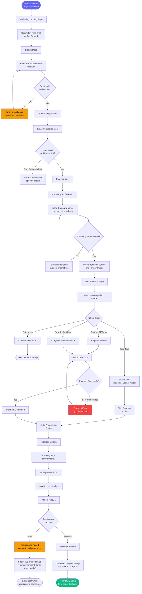

**Screens Involved:**

| Screen | Purpose | Epic/Feature |
|--------|---------|--------------|
| Marketing Landing Page | Value proposition, CTA | External (marketing site) |
| Signup Page | Email, password, name | E11-F1 |
| Email Verification Page | Confirmation prompt + resend | E11-F1 |
| Company Profile Form | Company name, size, industry | E11-F1 |
| Plan Selection Page | Feature comparison matrix | E12-F1 |
| Stripe Checkout | Payment collection | E12-F2 |
| Provisioning Progress | Real-time setup status | E11-F1 |
| Welcome Screen | First-agent wizard launch | E11-F2 |
| First-Agent Setup Wizard | Guided agent creation | E11-F2 |

**Decision Points:**
- Free trial vs. paid plan determines whether payment is collected
- Enterprise plan routes to sales team (not self-service)
- Provisioning failure falls back to async email notification
- Email verification required before proceeding
- Company name uniqueness checked in real-time

**Error States:**
- Duplicate email: "already registered" with login link
- Duplicate company name: suggestions or manual entry
- Card declined: retry with different payment method
- Email verification timeout (24h): resend option on next login attempt
- Provisioning failure: background retry + email notification when ready

---

### 4.2 Billing Management and Usage Monitoring

**Goal:** Manage subscription, view usage, download invoices, and handle plan changes.

**Trigger:** Tenant Admin needs to adjust billing, check usage against limits, or access invoices.

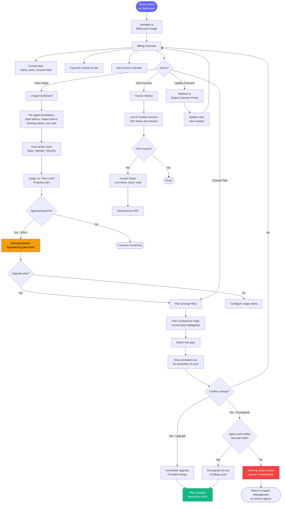

**Screens Involved:**

| Screen | Purpose | Epic/Feature |
|--------|---------|--------------|
| Billing Overview | Current plan, payment, next invoice | E12-F1 |
| Usage Dashboard | Per-agent token/tool metrics with charts | E12-F3 |
| Usage Alert Configuration | Set thresholds for email notifications | E12-F3 |
| Plan Comparison Page | Feature matrix with change option | E12-F1 |
| Plan Change Confirmation | Prorated cost and confirm/cancel | E12-F1 |
| Invoice History | List of past invoices | E12-F4 |
| Invoice Detail | Line-item breakdown with PDF download | E12-F4 |
| Stripe Customer Portal | External payment method management | E12-F2 |

**Decision Points:**
- Usage approaching limit triggers upgrade prompt vs. alert configuration
- Upgrade is immediate with prorated charge
- Downgrade requires agent count to be within new plan limits
- Downgrade takes effect at end of current billing cycle
- Invoice export available as PDF

**Error States:**
- Payment method expired: banner warning with link to update
- Failed auto-charge: 3 retries over 7 days, then suspension
- Plan downgrade blocked by agent count: must remove agents first
- Stripe portal unavailable: fallback to support contact

---

## Appendix: Screen Inventory Summary

### Platform Admin Dashboard Screens

| Screen ID | Screen Name | Flow(s) | Priority |
|-----------|-------------|---------|----------|
| PA-01 | Platform Admin Login (MFA) | 1.1 | P0 |
| PA-02 | Dashboard Home / System Overview | 1.1, 1.2 | P0 |
| PA-03 | Tenant List Table | 1.1, 1.2 | P0 |
| PA-04 | Tenant Provisioning Wizard (3 steps) | 1.1 | P0 |
| PA-05 | Provisioning Progress | 1.1 | P0 |
| PA-06 | Tenant Detail (tabbed: info, config, agents, resources, audit) | 1.2 | P0 |
| PA-07 | Configuration Editor (form + JSON) | 1.2 | P0 |
| PA-08 | System Health Dashboard (container grid) | 1.2 | P1 |
| PA-09 | Platform Service Status Panel | 1.2 | P1 |
| PA-10 | Alert History Timeline | 1.2 | P1 |
| PA-11 | Skill Review Queue | 1.3 | P1 |
| PA-12 | Skill Review Detail (code viewer + checklist) | 1.3 | P1 |
| PA-13 | Admin User Management | 1.1 | P0 |

### Tenant Admin Dashboard Screens

| Screen ID | Screen Name | Flow(s) | Priority |
|-----------|-------------|---------|----------|
| TA-01 | Tenant Login (email/password + OAuth) | 2.1 | P0 |
| TA-02 | Account Setup / Invite Acceptance | 2.1 | P0 |
| TA-03 | Welcome / Onboarding Checklist | 2.1 | P1 |
| TA-04 | Agent Overview Dashboard (cards + metrics + feed) | 2.1, 2.2, 3.1 | P0 |
| TA-05 | Agent Creation Wizard (5 steps) | 2.2 | P0 |
| TA-06 | Agent Detail (tabs: info, activity, skills, status) | 2.2, 2.3, 3.1 | P0 |
| TA-07 | Tool Policy Editor (checkbox grid) | 2.2 | P0 |
| TA-08 | Skill Marketplace Catalog | 2.3 | P1 |
| TA-09 | Skill Detail Page | 2.3 | P1 |
| TA-10 | Skill Install Confirmation Modal | 2.3 | P1 |
| TA-11 | Communication Allowlist Graph | 2.2 (Phase 2) | P1 |
| TA-12 | Team Members Page | 2.4 | P0 |
| TA-13 | Invite Member Dialog | 2.4 | P0 |
| TA-14 | Audit Log Table | 3.3 | P1 |
| TA-15 | Audit Log Detail Modal | 3.3 | P1 |
| TA-16 | Settings / Account | 2.1, 2.4 | P1 |

### Self-Service Screens (Phase 3)

| Screen ID | Screen Name | Flow(s) | Priority |
|-----------|-------------|---------|----------|
| SS-01 | Public Signup Page | 4.1 | P1 |
| SS-02 | Email Verification Page | 4.1 | P1 |
| SS-03 | Company Profile Form | 4.1 | P1 |
| SS-04 | Plan Selection / Comparison | 4.1, 4.2 | P0 |
| SS-05 | Stripe Checkout Integration | 4.1 | P0 |
| SS-06 | Provisioning Progress (self-service) | 4.1 | P1 |
| SS-07 | First-Agent Setup Wizard | 4.1 | P1 |
| SS-08 | Billing Overview | 4.2 | P1 |
| SS-09 | Usage Dashboard | 4.2 | P1 |
| SS-10 | Invoice History | 4.2 | P1 |
| SS-11 | Invoice Detail / PDF | 4.2 | P1 |
| SS-12 | Plan Change Confirmation | 4.2 | P1 |

---

## Appendix: Navigation Architecture

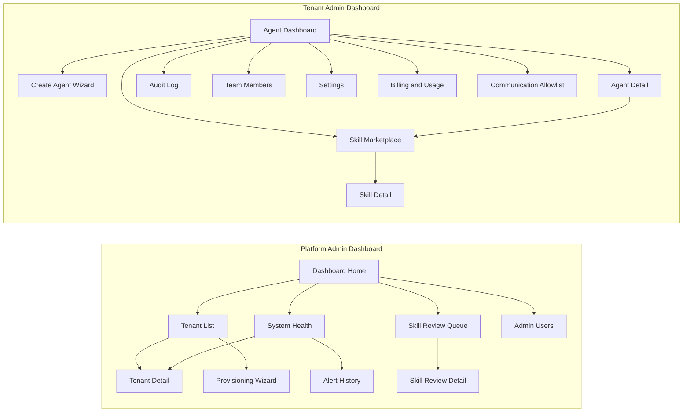

---

## Appendix: Role-Permission Matrix

| Action | Super Admin | Support Admin | Tenant Admin | Tenant Viewer |
|--------|:-----------:|:------------:|:------------:|:------------:|
| View all tenants | Yes | Yes | -- | -- |
| Provision tenant | Yes | No | -- | -- |
| Suspend/delete tenant | Yes | No | -- | -- |
| Edit tenant config | Yes | No | -- | -- |
| View system health | Yes | Yes | -- | -- |
| Review marketplace skills | Yes | No | -- | -- |
| Create agent | -- | -- | Yes | No |
| Configure agent tools | -- | -- | Yes | No |
| Install skills | -- | -- | Yes | No |
| View agent activity | -- | -- | Yes | Yes |
| View audit logs | -- | -- | Yes | Yes |
| Export audit logs | -- | -- | Yes | No |
| Invite team members | -- | -- | Yes | No |
| Change member roles | -- | -- | Yes | No |
| Manage billing | -- | -- | Yes | No |
| View usage metrics | -- | -- | Yes | Yes |
| Manage API keys | -- | -- | Yes | No |
